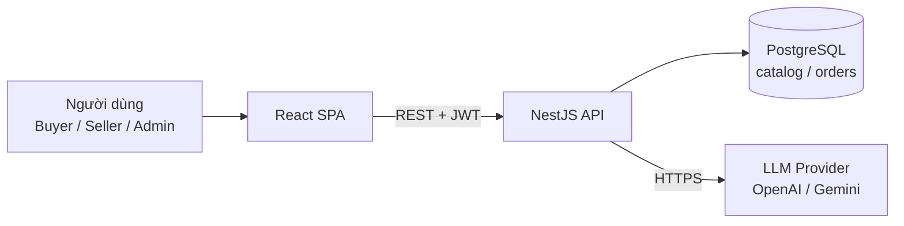
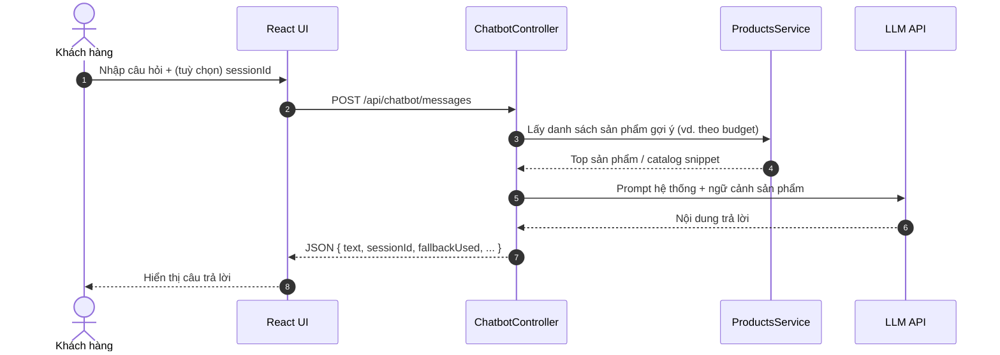

# 6. Tích hợp AI trong ShopBot E-Commerce

Tài liệu mô tả cách **ShopBot** tích hợp LLM (OpenAI, Google Gemini hoặc chế độ rule-based) để tư vấn mua sắm trong phạm vi TMĐT. **Không gọi API key từ trình duyệt** — mọi luồng đi qua `ChatbotModule` (NestJS); có thể bổ sung dữ liệu catalog từ `ProductsService` vào prompt.

**Nhóm thực hiện:** 6 thành viên; module chatbot phối hợp với nhóm frontend (UI) và DevOps (cấu hình env).

---

## 6.1 Sơ đồ kiến trúc (tổng quan)



👉 Backend giữ bí mật API key; có thể giới hạn context / token và rate limit (Throttler) để kiểm soát chi phí.

---

## 6.2 Luồng sequence (tư vấn theo ngân sách)



---

## 6.3 Use case AI (TMĐT)

```mermaid
usecaseDiagram
    actor Buyer as Khách hàng
    package "Chatbot ShopBot" {
        usecase "Tư vấn sản phẩm theo nhu cầu / ngân sách" as UC1
        usecase "Giải thích chính sách giao hàng / đổi trả (trong phạm vi cho phép)" as UC2
        usecase "Gợi ý sản phẩm liên quan từ catalog" as UC3
    }
    Buyer --> UC1
    Buyer --> UC2
    Buyer --> UC3
```

👉 **Giá trị gia tăng:** giảm thời gian tìm kiếm, tăng tính tương tác; có thể mở rộng thêm moderation nội dung và log phiên phục vụ báo cáo.
