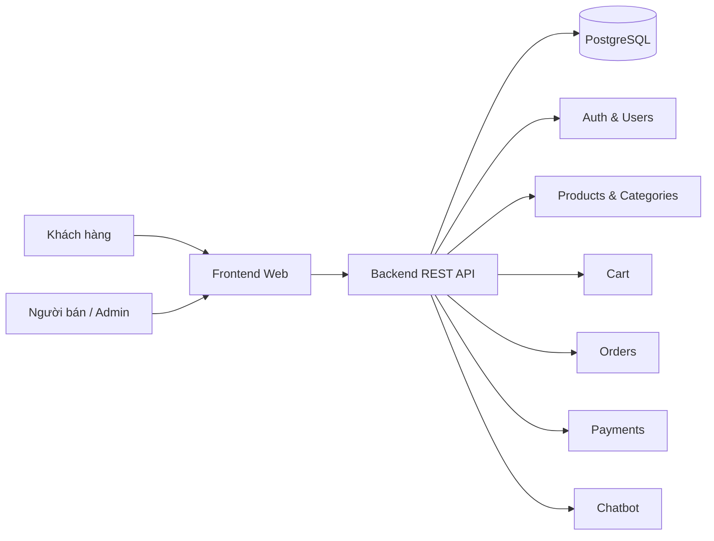

# System Architecture — ShopBot E-Commerce

> Đề tài: [de-tai/shopbot-summary.docx](../de-tai/shopbot-summary.docx). Mục lục: [docs/README.md](../README.md).

## Kiến trúc đề xuất: 3-Tier + monolith tầng ứng dụng

- **Presentation layer**: React (Vite) — khách, người bán, quản trị.
- **Application layer**: NestJS REST API — auth, catalog, giỏ, đơn, thanh toán, chatbot.
- **Data layer**: PostgreSQL.

### Lý do

1. Đủ gọn cho môn học, dễ triển khai và bảo trì.
2. Có thể tách dịch vụ sau nếu quy mô tăng.
3. Tách UI, nghiệp vụ và DB rõ ràng, dễ kiểm thử.

## Sơ đồ module (Mermaid)

## Thành phần chính

- **Frontend**: đăng nhập theo vai trò, xem catalog, giỏ, đơn, chatbot, quản trị user (seller/admin).
- **Backend**: JWT + roles; API sản phẩm; giỏ (in-memory demo); đơn hàng và luồng trạng thái giao hàng; thanh toán; chatbot tư vấn sản phẩm.
- **Database**: schema quan hệ trong `schema.sql`, đồng bộ với TypeORM entities.
