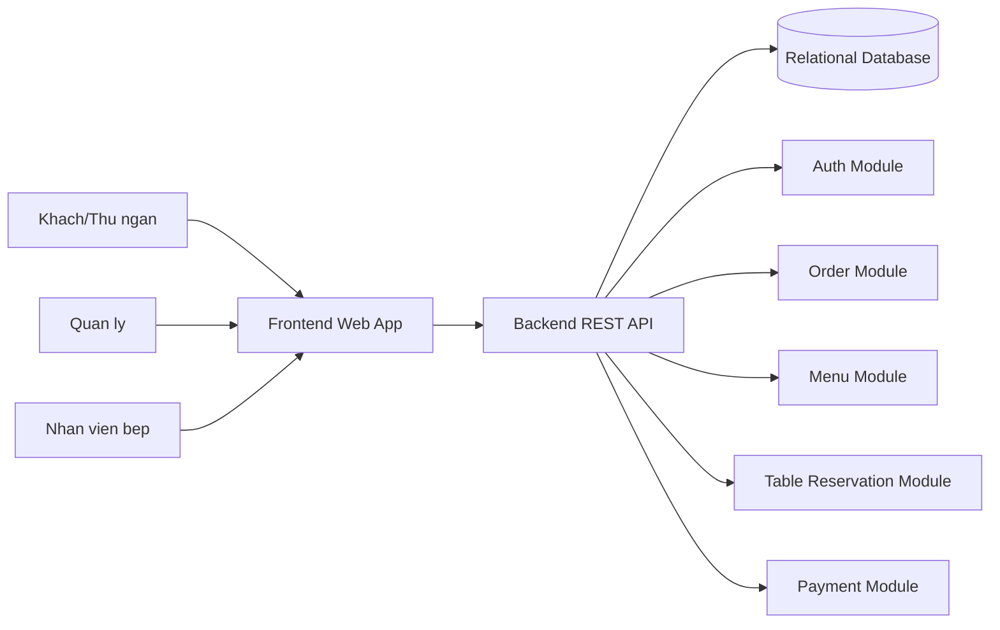

# System Architecture Diagram — Mini project Quản lý quán ăn

> **Phụ lục** trong repo **ShopBot E-Commerce** (đề tài: [de-tai/shopbot-summary.docx](../de-tai/shopbot-summary.docx)). Mục lục tài liệu: [docs/README.md](../README.md).

## Kiến trúc đề xuất: 3-Tier Architecture + Layered Monolith

Kien truc 3 lop phu hop voi mini project vi de trien khai, de bao tri, nhom co the phan chia cong viec ro rang:

- **Presentation Layer**: Web UI cho thu ngan, quan ly, va bep.
- **Application Layer**: Backend API xu ly nghiep vu (don hang, ban, mon an, thanh toan, ton kho nhe).
- **Data Layer**: Co so du lieu quan he (MySQL/PostgreSQL).

### Ly do chon kien truc nay

1. **Don gian va nhanh**: De hoan thanh trong thoi gian mon hoc.
2. **De mo rong**: Co the tach dần thanh microservices khi quy mo lon.
3. **De test**: Tach biet UI, business logic, va DB.
4. **Phu hop doi ngu sinh vien**: Moi thanh vien phu trach mot lop/chuc nang.

## So do kien truc (Mermaid)

## Thanh phan chinh

- **Frontend**: Hien thi menu, tao don, cap nhat trang thai don, quan ly mon.
- **Backend API**:
  - `Auth`: Dang nhap va phan quyen.
  - `Menu`: CRUD mon an, danh muc.
  - `Order`: Tao va xu ly don hang.
  - `Table`: Quan ly ban va dat ban.
  - `Payment`: Ghi nhan thanh toan.
- **Database**: Luu du lieu co cau truc va dam bao toan ven giao dich.

